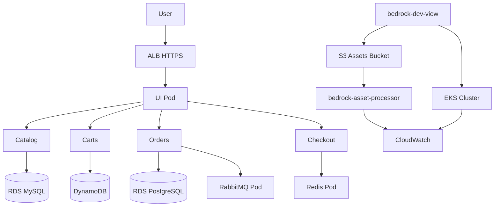

# Project Bedrock — Architecture Diagram

Use this document as the basis for your submission architecture diagram (draw.io, Lucidchart, etc.).

## Components

### Network (VPC: project-bedrock-vpc)

| Subnet | AZ | Purpose |
|---|---|---|
| Public 10.0.0.0/20 | us-east-1a | NAT Gateway, ALB |
| Public 10.0.16.0/20 | us-east-1b | ALB |
| Private 10.0.32.0/20 | us-east-1a | EKS nodes, RDS |
| Private 10.0.48.0/20 | us-east-1b | EKS nodes, RDS |

Single NAT Gateway for cost optimization.

### Compute

- **EKS Cluster:** project-bedrock-cluster (Kubernetes 1.34+)
- **Node Group:** bedrock-nodes (t3.medium, private subnets)
- **Namespace:** retail-app

### Application (Helm — retail-store-sample-app)

| Service | Data Store | Notes |
|---|---|---|
| catalog | RDS MySQL 8.0 | Credentials in Secrets Manager → K8s secret |
| orders | RDS PostgreSQL 16 | RabbitMQ in-cluster |
| carts | DynamoDB | IRSA for pod IAM role |
| checkout | Redis in-cluster | — |
| ui | — | Exposed via ALB Ingress |

### Ingress & TLS

- AWS Load Balancer Controller creates internet-facing ALB
- Ingress resource routes traffic to `ui` service
- ACM certificate terminates HTTPS (when domain configured)
- Route53 CNAME → ALB hostname

### Observability

- EKS control plane logs → CloudWatch (`/aws/eks/project-bedrock-cluster/cluster`)
- Container logs → CloudWatch via `amazon-cloudwatch-observability` add-on

### Serverless

```
bedrock-dev-view ──PutObject──► S3 (bedrock-assets-alt-soe-025-4363)
                                      │
                                      ▼ ObjectCreated
                               Lambda (bedrock-asset-processor)
                                      │
                                      ▼
                               CloudWatch Logs: "Image received: <key>"
```

### IAM

| Principal | Access |
|---|---|
| bedrock-dev-view | AWS ReadOnly + S3 PutObject on assets bucket |
| bedrock-dev-view | EKS AmazonEKSViewPolicy (kubectl read-only) |
| carts ServiceAccount | DynamoDB via IRSA |
| GitHub Actions OIDC | github-terraform-bedrock role |

### CI/CD

```
PR → terraform plan → comment on PR
Merge to main → terraform apply → update grading.json
```

## Mermaid diagram (for reference)


